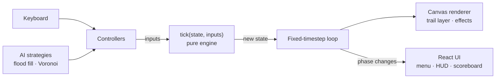

# BrightBike

A Tron-style light-cycle game for the browser. Steer a bike that never stops moving, leave a
wall of light behind you, and be the last rider on the grid.

**▶ Play: https://brightbike.vercel.app**

## Features

- **Single player** against a CPU opponent at three difficulty levels: easy, medium, hard
- **Local multiplayer**: two players on one keyboard
- **Matches**: first to 1, 3, or 5 rounds, with a live scoreboard, rematch, and pause
- **Neon visuals**: glowing light trails, crash explosions, and screen shake (reduced for
  players who prefer less motion)
- **Synthesized sound** with the Web Audio API: countdown, engine hum, turns, and crashes, with
  no audio files to download. Mute with `M`; the setting is remembered.
- **Responsive**: the arena scales to fit the window and stays sharp at any size, zoom level, or
  pixel density

## Controls

| Action | Player 1 (Blue) | Player 2 (Red) |
|---|---|---|
| Steer | `W` `A` `S` `D` | `↑` `←` `↓` `→` |
| Pause / resume | `Esc` | `Esc` |
| Confirm (next round, play again) | `Enter` | `Enter` |
| Mute / unmute | `M` | `M` |

In single player, both `WASD` and the arrow keys steer your bike. Hit a wall or any trail,
including your own, and you're out. If both riders crash on the same tick, the round is a draw.

BrightBike is played with a keyboard; touch devices show a "best on desktop" notice.

## Tech stack

**Next.js 16** (App Router) · **React 19** · **TypeScript** · **Canvas 2D** · **Web Audio API** ·
**Tailwind CSS 4** · **Vitest** · deployed on **Vercel**

## Architecture



- **Engine** (`src/engine/`): the game rules as one pure function, `tick(state, inputs) → state`.
  It doesn't touch the DOM, React, or randomness, and ESLint enforces that.
- **Controllers** (`src/controllers/`): anything that steers a bike implements one interface.
  Keyboard and AI players are interchangeable, and a network player can be added later the same way.
- **AI** (`src/ai/`): pure strategy functions that read the game state and return a direction.
- **Rendering** (`src/render/`): Canvas 2D with prebuilt layers, so each frame stays cheap.
- **UI** (`src/components/`): React handles menus, overlays, and score. Game state lives
  outside React state, so React re-renders only when the UI actually changes, not every frame.

## Engineering highlights

- **Deterministic, fully tested engine.** The same state and inputs always produce the same
  result. The rules are covered by unit tests, and those tests were also run against
  deliberately broken versions of `tick()` to confirm that each one catches the bug it targets.
- **Fixed-timestep game loop.** The game runs at the same speed on 60 Hz and 144 Hz monitors, and
  resuming from a pause or a background tab doesn't fast-forward the game.
- **Three AI levels.** *Easy* looks one cell ahead. *Medium* uses flood fill to steer toward
  the most open space. *Hard* uses a Voronoi split of the board to claim the cells it can reach
  before its opponent can. Each move takes under a millisecond on average.
- **Measured AI strength.** A seeded AI-vs-AI test plays hundreds of full games in Node. Over 200
  games per pairing, medium beat easy **94.5%** of the time, hard beat easy **100%**, and hard
  beat medium **96.5%**. An earlier version replayed only 8 distinct games across 200 seeds,
  because the medium and hard AIs are nearly deterministic. Each game now starts with a short
  random opening, so every seed plays a different game. Fixed seeds mean the results are
  identical on every run.
- **Glowing trails without redrawing them.** Trails are drawn onto a separate canvas that keeps
  its pixels. Each tick adds only the newest segment, and the stored segment list is redrawn
  when the window is resized.
- **Browser-friendly audio.** The audio context is created only after the player has interacted
  with the page, so the browser never logs an autoplay warning, and sound starts as soon as the
  player clicks or presses a key.

## Running locally

Requires **Node.js 22.12 or newer**.

```bash
npm install
npm run dev          # http://localhost:3000
```

| Command | What it does |
|---|---|
| `npm run dev` | Start the development server |
| `npm test` | Run the test suite once (engine, controllers, AI, game logic) |
| `npm run test:watch` | Re-run tests on file changes |
| `npm run lint` | ESLint, including the engine/AI purity rules |
| `npm run build` | Production build (includes type-checking) |
| `npm start` | Serve the production build |

To start a game directly from a URL:
`/play?mode=ai&difficulty=hard&firstTo=5` or `/play?mode=local&firstTo=3`.
Unknown values fall back to the defaults.

## Project structure

```
src/
  app/          Next.js routes: menu (/) and game (/play), layout, icon
  components/   React UI: MainMenu, Game, GameCanvas, Hud, Scoreboard
  engine/       Pure game rules: types, createGame, tick, collision (+ tests)
  ai/           Pure AI: seeded RNG, moves, flood fill, Voronoi, strategies (+ arena test)
  controllers/  Keyboard and AI controllers, input buffering (+ tests)
  game/         Modes, options/URL parsing, match scoring, tick events (+ tests)
  render/       Canvas drawing, trail layer, effects, theme
  audio/        Synthesized sound effects
```

`PLAN.md` documents the development plan step by step, including the design decisions and
the measurements behind them.

## Roadmap

- **Trail-length mode**: trails that fade after a set length, as an alternative to classic
  permanent walls
- **Online multiplayer**: run the same engine on an authoritative server, with a network
  controller and room codes
